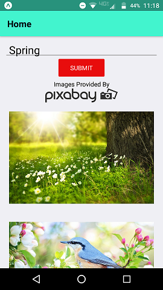
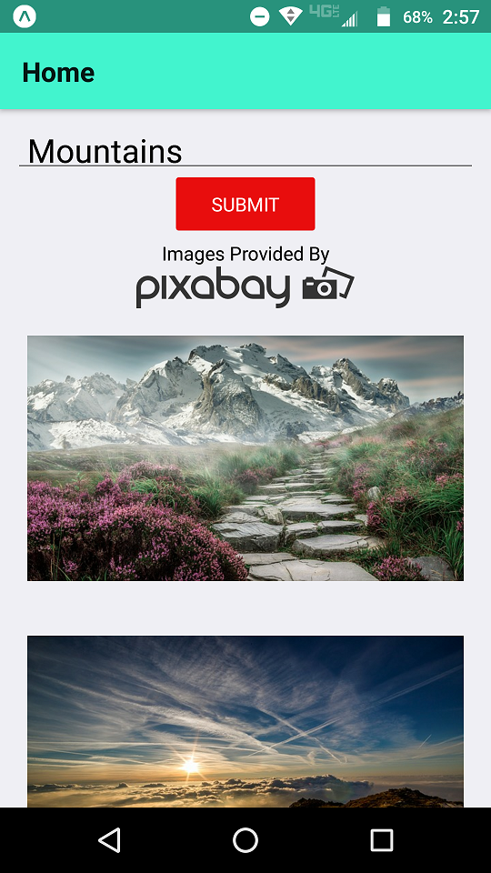
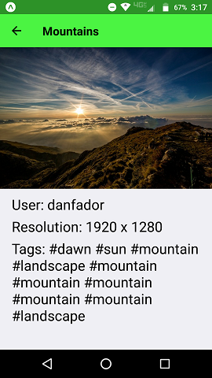

# Image Search

<p align="center">
  
</p>

This project is a basic image search mobile application meant for Android (I have tested it only on Android, though as far as I know, all features should also be functional on iOS devices). I created the application using `react-native` along with `redux`. (This project was bootstrapped with [Create React Native App](https://github.com/react-community/create-react-native-app).) All images were obtained from the free image sharing website [Pixabay](https://pixabay.com/) using its [API](https://pixabay.com/api/docs/). A link to the website is also provided in the application at the beginning of result displays.

## Downloading The Project

* To download, you can clone the repository using this terminal command:
```
git clone https://github.com/wbchristerson/ImageSearch.git
```

Alternatively, follow the instructions below to download to a hard drive:
* Click the green "Clone or download" button above then choose "Download ZIP".
* Find the folder `ImageSearch-master` in your Downloads folder or wherever it was placed on your device.
* Right click and choose "Extract All".

In all cases, having downloaded the files:

* To install all dependencies from the command line, run the following command in the terminal within the project repository:
    - `npm install`
* Run the following command, also in the project repository:
    - `npm start`

The terminal will then provide you with several options. If you have the application [Expo](https://expo.io/) on your device, then you can scan the accompanying QR code that appears, which will then give you the option to run the application on mobile (note: the scan is most easily recognized on terminals with a black background and a gray or white foreground).

For complete details about running react-native applications such as this one on mobile devices, see [here](https://github.com/react-community/create-react-native-app/blob/master/react-native-scripts/template/README.md).

## Design

The main screen includes a search field from which to query images. At most 100 photographs matching the search term with a safe search flag will appear in the form of a React Native `FlatList`, which is meant to be more efficient than using a `ScrollView` for such a sizeable amount of data.

<p align="center">
  
</p>

Clicking on any of the resulting images sends the user to an individual image page, which shows a faded-in larger view of the selected image together with data such as the username of the Pixabay user who took the photograph, the original resolution of the image, and the associated image tags.

<p align="center">
  
</p>

A navigation arrow sends the user back to the original list page at the same position. Queries are restricted to those with URL-encodings not exceeding a length of 100.

Ignore warnings from React Native about deprecated component lifecycle functions.

## Remaining Issues

* When switching orientations between portrait and landscape mode, the same images that were visible in one view are only roughly the same images visible in the rotated view.
* In some cases, upon scrolling to the end of the search results, subsequent scrolling ends with the `FlatList` jerking slightly up or down before stopping.
